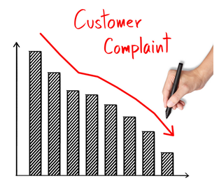

# Consumer_Complaint_Project
### Consumer Complaint Project - Capstone Project for Galvanize Data Science Immersive May 2016

Image courtesy of: http://www.ris.world/sites/default/files/problem-solving-icon-M115584.jpg

## Introduction
Customer service is an important part of any business.  In current conditions,

## Objective
The goal of this project is to determine if the text provided describing a complaint can predict the outcome of that complaint.  This can be extremely useful to an organization so that they understand ....

Image courtesy of:
http://www.gimconsultancy.com/images/course/146760856426786695547.png

## Data
Data was obtained from the Consumer Financial Protection Bureau (CFPB) (http://www.consumerfinance.gov/)

The data available contains 596096 entries, with 18 individual features for each entry.  The entries of interest were the "Consumer complaint narrative", a block of text input by the consumer describing their issue.  The data set for this analysis was reduce to only contain entries with a complete "Consumer caomplaint narrative", leaving 84466 entries to work with.  

The data provided is anonomized with respect to customer names/account numbers/other personal information.  

The data contains the "target" label for the analysis in the "Company response to consumer" column.  This column was converted to a three category list for classification:

The following scheme was used for classification:

Closed = 0
Untimely response = 0
Closed with explanation = 1
Closed with non-monetary relief = 2
Closed with monetary relief = 2

## Modeling
Data was reduced from its original forom of ~600K entries to ~84K entries containing a "Consumer complaint narrative".  Data which was missing/not provided or incomplete was addressed during data cleaning, and missing/incomplete ZIP Codes were addressed using the "pyzipcode" package (https://pypi.python.org/pypi/pyzipcode).  Features were converted from categorical to numerical or boolean values for input into models.

## Using the Model
The model can be run...

## Results and Recommendations
#### Results
MODELING RESULTS USING NO TEXT FEATURES:
Using entire dataset:

Using reduced (~84K sample) dataset:

MODELING RESULTS USING TEXT FEATURES:

#### Recommendations
Based on the classification scheme, a company using this analysis would want to investigate further into complaints classified as "2", as these complaints provide the customer some sort of "relief".

Closed = 0
Untimely response = 0
Closed with explanation = 1
Closed with non-monetary relief = 2
Closed with monetary relief = 2

## Follow-on Activities
1. Investigate makeup of classified groups - What similarities do these groups have?
2. Apply NLP to "Company response to consumer" column
