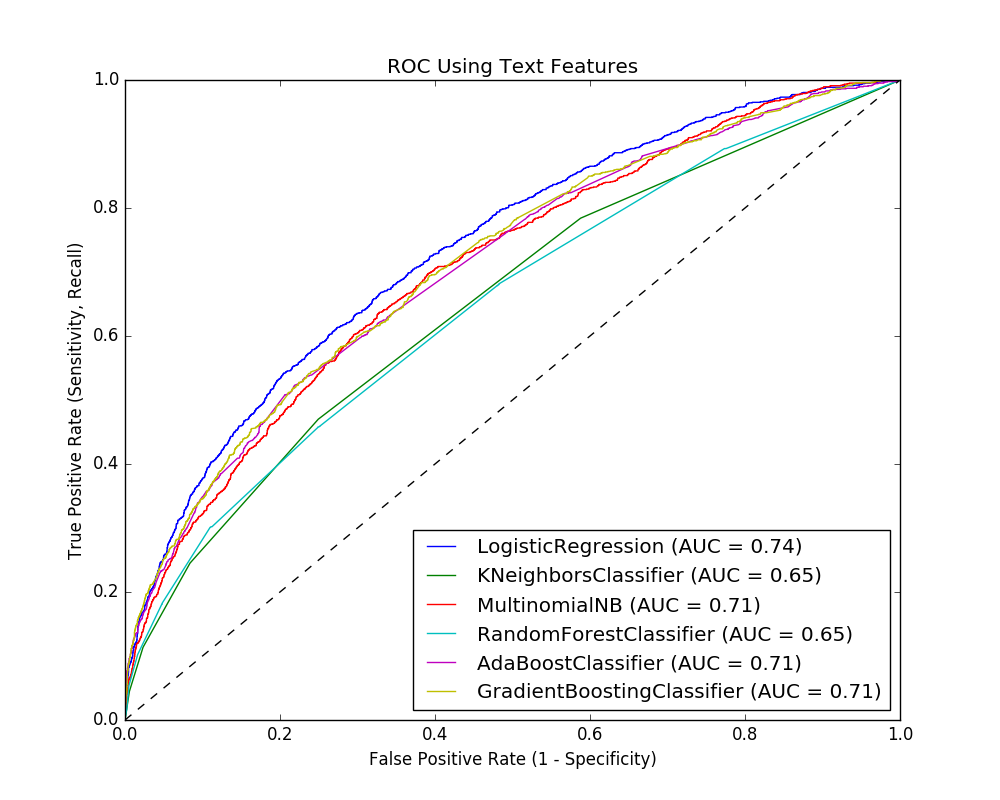

# Consumer_Complaint_Project
### Consumer Complaint Project - Capstone Project for Galvanize Data Science Immersive May 2016


Image courtesy of: http://www.ris.world/sites/default/files/problem-solving-icon-M115584.jpg

## Introduction
Customer service is an important part of any business.  In current conditions,

## Objective
The goal of this project is to determine if the text provided describing a complaint can predict the outcome of that complaint.  This can be extremely useful to an organization so that they understand ....


Image courtesy of:
http://www.gimconsultancy.com/images/course/146760856426786695547.png

## Data
Data was obtained from the Consumer Financial Protection Bureau (CFPB) (http://www.consumerfinance.gov/)


Image courtesy of:
http://www.consumerfinance.gov/

The data available contains 596096 entries, with 18 individual features for each entry.  The entries of interest were the "Consumer complaint narrative", a block of text input by the consumer describing their issue.  The data set for this analysis was reduce to only contain entries with a complete "Consumer complaint narrative", leaving 84466 entries to work with.  

The data provided is anonomized with respect to customer names/account numbers/other personal information.  

The data contains the "target" label for the analysis in the "Company response to consumer" column.  This column was converted to a two category list for classification:

The following scheme was used for classification:

Closed = 0
Untimely response = 0
Closed with explanation = 0
Closed with non-monetary relief = 1
Closed with monetary relief = 1

## Modeling
Data was reduced from its original forom of ~600K entries to ~84K entries containing a "Consumer complaint narrative".  Data which was missing/not provided or incomplete was addressed during data cleaning, and missing/incomplete ZIP Codes were addressed using the "pyzipcode" package (https://pypi.python.org/pypi/pyzipcode).  Features were converted from categorical to numerical or boolean values for input into models.


## Using the Model
The text-features model can be run from the 'src/' folder with the command:
```python
python model.py  
```

The non-text feature model is run in the "eda/" folder in an iPython notebook.  
The model was run as a sanity check and is not expected to be used in any analysis.

## Results and Recommendations
#### Results
MODELING RESULTS USING NO TEXT FEATURES:


MODELING RESULTS USING TEXT FEATURES:


#### Recommendations
Predicting the outcome of a complaint will provide a business with the ability to:
- Position resources to properly address claim  
- Manage costs


## Follow-on Activities
1. Investigate makeup of classified groups - What similarities do these groups have?
2. Does length of time of the claim (i.e. processing time) have an effect on relief?
3. Apply NLP to "Company response to consumer" column
4. Run Word2Vec on model
